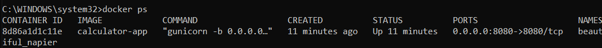
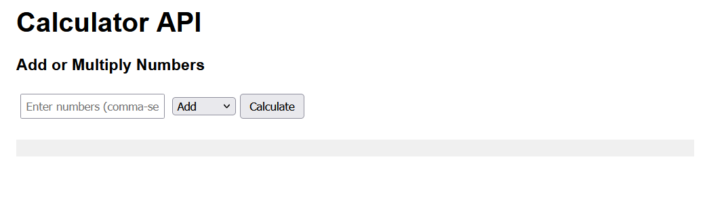
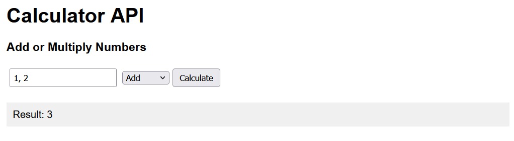
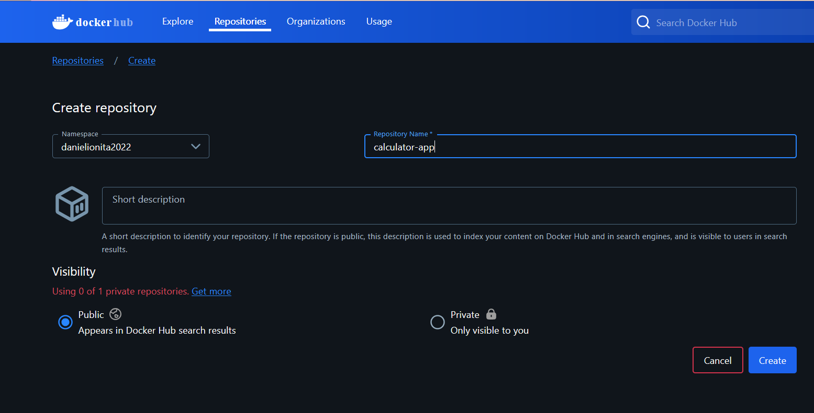
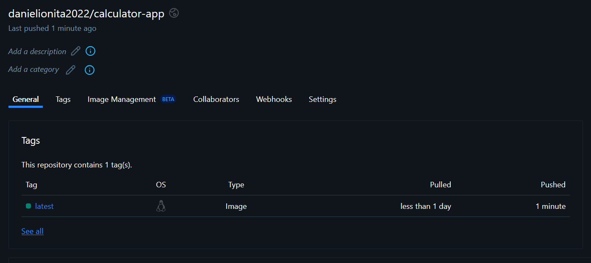
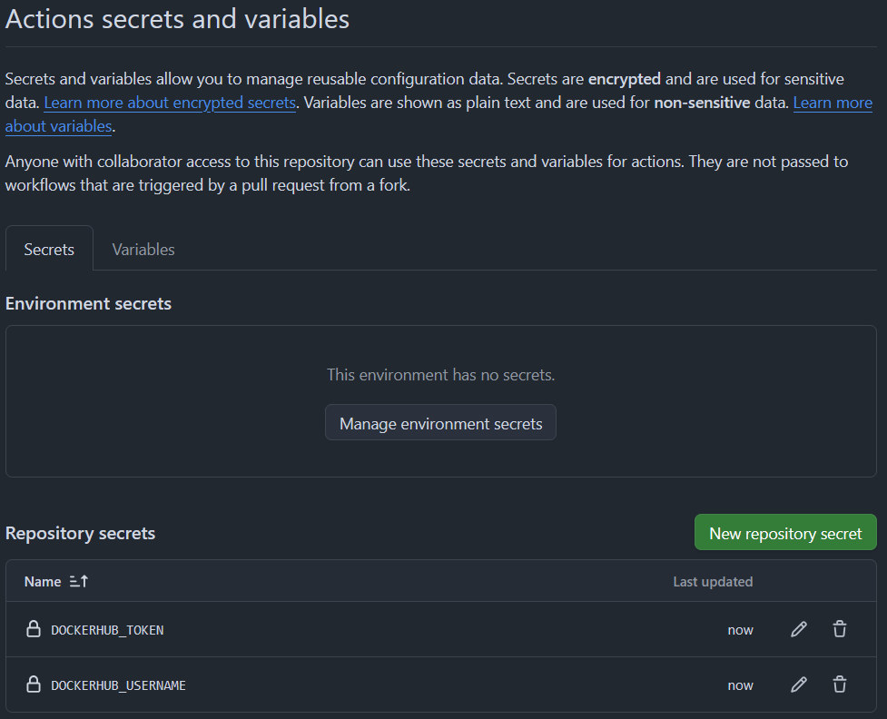
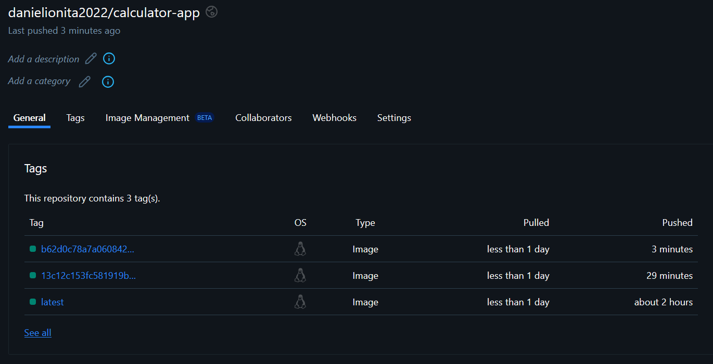

# Containerization and Automation

Dockerfile is located within flask-app folder
```
docker build -t calculator-app .
docker run -p 8080:8080 calculator-app
```

## Testing

We open a separate terminal and run:

```
docker ps
```

to check that our container is running on the desired port.



Navigating to http://localhost:8080 we see the displayed web page, where we can add and multiply numbers.

Screenshots:




## Set Up a Docker Registry

Creating a public repository on Docker Hub



```bash
docker tag calculator-app danielionita2022/calculator-app:latest
docker login
docker push danielionita2022/calculator-app:latest
```
The above commands push the tagged image to the created repository.



## Automation

Workflow YAML file is located in .github/workflows, automating all the specified steps.

Set up secrets in Github Actions:



Screenshot with Docker images tagged with commit SHA:



### Bonus

Added code for the application to catch Docker container's stop signal and shut down gracefully.

```python
def handle_shutdown(signum, frame):
    print(f"Received signal {signum}: shutting down gracefully...")
    sys.exit(0)

signal.signal(signal.SIGINT, handle_shutdown)
signal.signal(signal.SIGTERM, handle_shutdown)
```
