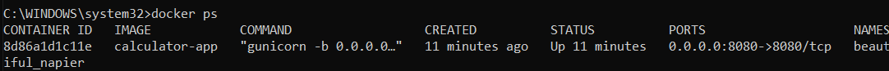
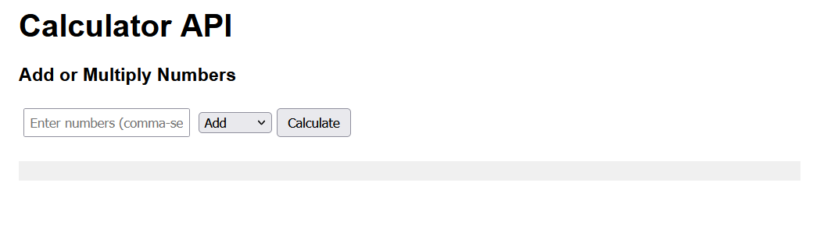
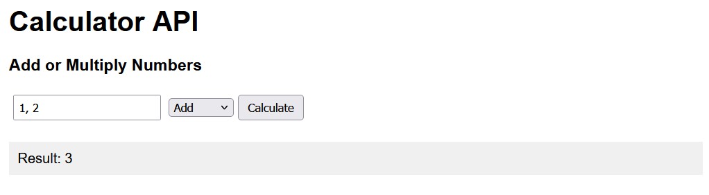

# Containerization and Automation

Dockerfile is located within flask-app folder
```
docker build -t calculator-app .
docker run -p 8080:8080 calculator-app
```

## Testing

We open a separate terminal and run:

```
docker ps
```

to check that our container is running on the desired port.



Navigating to http://localhost:8080 we see the displayed web page, where we can add and multiply numbers.

Screenshots:


