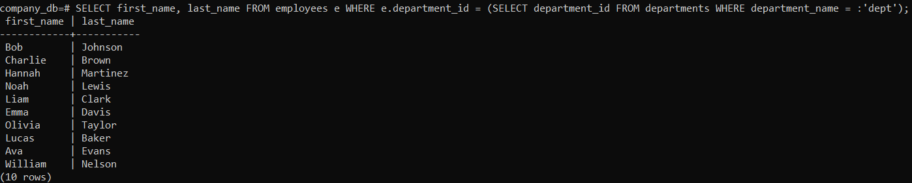

# PostgreSQL

## • Pull and run a PostgreSQL container

```bash
docker pull postgres
docker run --name postgres_container -e POSTGRES_USER=tremend -e POSTGRES_DB=company_db -e POSTGRES_PASSWORD=1234 -d postgres
```

## • Create a dataset using the sql script provided

### !! Important: in the populatedb.sql script there are only 53 employees inserted, and in the salaries table it attempts to insert the salaries of 76 employees. I have decided to manually remove the entries that reference employees 54-76.

Enter the directory where the file populatedb.sql was downloaded

```bash
docker cp populatedb.sql postgres_container:/populatedb.sql
docker exec -it postgres_container psql -U tremend -d company_db -f /populatedb.sql
```

## • Run the following SQL queries

```bash
docker exec -it postgres_container psql -U tremend -d company_db
```

### o Find the total number of employees

```sql
SELECT COUNT(*) FROM employees;
```


### o Retrieve the names of employees in a specific department (prompt for user input)

```sql
\prompt 'Enter department: ' dept
SELECT first_name, last_name FROM employees e WHERE e.department_id = (SELECT department_id FROM departments WHERE department_name = :'dept');
```



### o Calculate the highest and lowest salaries per department

```sql
SELECT d.department_name, MAX(s.salary), MIN(s.salary) FROM departments d 
JOIN employees e ON d.department_id = e.department_id 
JOIN salaries s ON e.employee_id = s.employee_id 
GROUP BY d.department_name;
```


### • Dump the dataset into a file

```bash
docker exec postgres_container pg_dump -U tremend company_db > dump.sql
```

### • Write a Bash script

The script is located in the same folder as this README.

### Bonus: Mount a persistent volume

When starting a container, you need to add the -v flag, the name of the volume and its path to mount a persistent volume.

```bash
docker run --name postgres_container -e POSTGRES_USER=tremend -e POSTGRES_DB=company_db -e POSTGRES_PASSWORD=1234 -v pg_volume:/data -d postgres
```